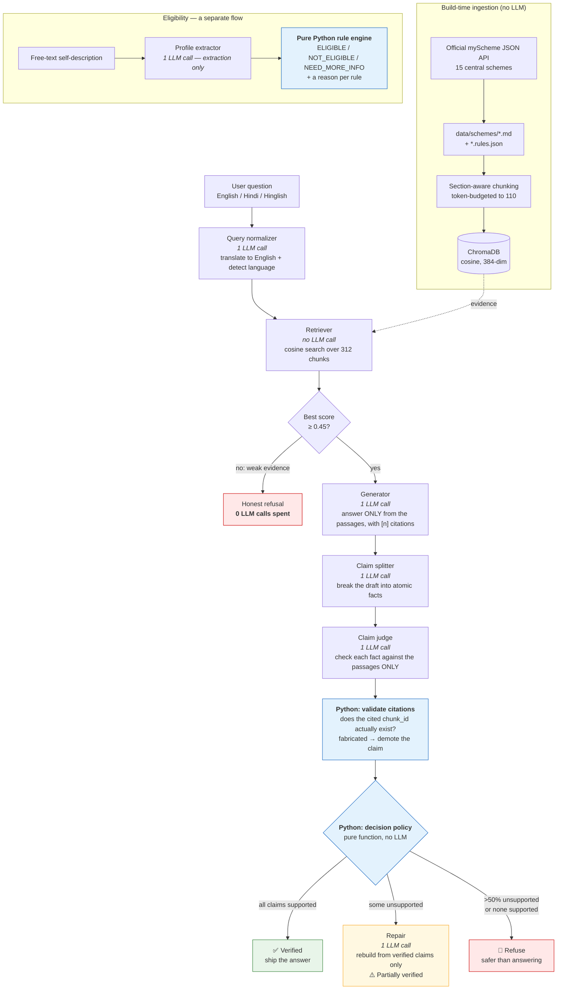

# SchemeSure

**A hallucination-aware RAG assistant for Indian government scheme information.**
Ask in English, Hindi or Hinglish. Every answer is checked claim-by-claim against
the retrieved official text *before* it reaches you — and when the evidence is not
there, it says so instead of guessing.

🔗 **Live demo:** <!--DEMO_URL-->**https://schemesureaakash.streamlit.app**<!--/DEMO_URL-->
🔗 **Code:** https://github.com/aakashc23/schemesure

Ask it in Hinglish and it answers in Hinglish, verified and cited:

> **Q:** *PM Kisan ka paisa kitna milta hai?*
> **✅ Verified** — "PM Kisan scheme mein har family ko saal mein Rs. 6000 milte
> hain [2]. Ye paisa teen barabar hisson mein diya jata hai, jismein har hissa
> Rs 2000 ka hota hai [2]."

Then open **"How was this verified?"** to see each claim and the passage it was
checked against. Try the last two examples in the dropdown to watch it refuse.

*(The FastAPI service is internal to the deployed process and is not exposed
publicly — run it locally to get `/docs`. See [Local setup](#local-setup).)*

---

## The problem

A person wants to know whether they qualify for a government scheme. Ask a
general-purpose chatbot and you get a fluent, confident answer that is sometimes
wrong — a slightly wrong amount, an age limit from a different scheme, an
eligibility rule that does not exist. For welfare information that is not a
cosmetic flaw: it sends someone to a government office with the wrong documents,
or convinces them not to apply for money they were entitled to.

Retrieval-augmented generation helps, but it does not solve this. **It is the
plausible-looking failure that is dangerous**, and I measured it on this very
system: asking about *Sukanya Samriddhi Yojana* — a real scheme this project does
**not** index — retrieves PM-Mudra passages at **0.71** cosine similarity, far
above the 0.45 refusal threshold. A naive RAG pipeline answers that question
confidently, from the wrong scheme's text.

So SchemeSure assumes the model will sometimes be wrong, and checks its work.

## Two ideas hold the project together

**1. LLM for language, code for rules.**
The model translates, drafts and judges text. It never decides anything. Every
threshold, every comparison and every eligibility verdict is plain Python —
deterministic, unit-tested, and able to explain itself.

**2. Never trust the output; verify it against the evidence.**
Every drafted answer is split into atomic claims, each claim is checked against
only the retrieved passages, and the decision to publish, repair or refuse is
made in code.

---

## Architecture



Everything in blue is Python with no LLM involved — that is deliberate, and it is
the part that makes the guarantees real.

---

## How it works, step by step

### 1. Understand the question (1 LLM call)

One call returns `{normalized_query, language}`. This step is not cosmetic — it is
load-bearing, and the measurements say why. The *same* PM-KISAN question, scored
against the passage that actually answers it:

| How the question was asked | Similarity | Top result |
|---|---|---|
| English | **0.574** | ✅ correct scheme |
| Hindi (Devanagari) | 0.610 | ❌ wrong scheme |
| Hinglish (romanised) | **0.436** | ❌ wrong scheme — *and below the 0.45 threshold* |

Romanised Hindi is the hardest case: the embedding model saw Devanagari Hindi and
English in training, not Hindi spelled in Latin letters. Without normalisation, a
Hinglish speaker would be told we have no information about a scheme we have fully
indexed. If the call fails, the system falls back to the raw query plus a
script-based language guess and flags `fallback_used` rather than failing silently.

### 2. Retrieve, and judge the evidence (no LLM call)

Cosine search over 312 chunks. The retriever does not just return passages, it
returns a verdict: `low_evidence=True` when even the best match is below
threshold. **The threshold was calibrated, not guessed** — on 22 real queries:

| Query type | Score range |
|---|---|
| Answerable, English | 0.574 – 0.893 |
| Out of scope ("capital of France", "pizza recipe") | 0.100 – 0.350 |
| **Safe window** | **0.350 – 0.574** → threshold **0.45** |

### 3. Refuse early when the evidence is weak (0 LLM calls)

If nothing retrieved clears the threshold, there is nothing to ground an answer
in, so no answer is generated. Out-of-scope questions therefore cost **nothing**.

### 4. Draft an answer (1 LLM call)

Grounded strictly in the retrieved passages, cited as `[n]`, in the user's own
language.

### 5. Verify it — the heart of the project (2 LLM calls + Python)

- **Split into atomic claims.** One sentence often carries two facts ("Rs 6,000 a
  year, paid in three instalments"). A sentence-level check passes the whole
  sentence if *either* half is right, which is exactly how a wrong number
  survives verification.
- **Judge each claim against the passages only.** The judge never sees the
  question — a judge that knows what the answer was *supposed* to say is biased
  toward approving it. "Probably true in the real world" counts as
  NOT_SUPPORTED, by design.
- **Validate the citation in Python.** The judge must name the `chunk_id` that
  supports each claim, and code checks that it exists. A judge marking a claim
  SUPPORTED while citing a passage that was never retrieved is hallucinating
  about its own evidence — an authoritative-looking verdict that is worthless.
  Set membership is something code gets exactly right, every time.
- **Decide in Python.** `decide()` is a pure function: all supported → PASS; some
  unsupported → REPAIR; more than half unsupported, or none supported → BLOCK.

An LLM judging its own work is not a control, it is another generation. So the
parts that must not be wrong are code.

### 6. Repair or refuse

REPAIR hands the model a fixed list of verified facts and tells it to state those
and nothing else — so the claim that just failed cannot reappear. BLOCK returns a
hand-written refusal, because a refusal is the one message that must never itself
be hallucinated.

### Eligibility is a separate flow, and no LLM decides it

One call turns "I'm a 35 year old farmer from Bihar earning about 2 lakh" into
fields. Everything after that is `if` statements. Missing data becomes
**NEED_MORE_INFO**, never a guess — because a guessed value produces a
confidently wrong verdict about someone's entitlement. Conditions a flat rule
schema cannot express (Stand-Up India's "if male, must be SC/ST"; PM Ujjwala's
alternative categories) are surfaced as "still to verify" rather than forced into
a numeric field.

---

## Evaluation

The same 50 golden-set questions run twice — guardrail **off** (plain RAG) and
**on** — with identical retrieval, model and prompts. Full numbers and method:
**[`eval/results.md`](eval/results.md)**.

<!--EVAL_TABLE_START-->
> **Not yet run.** The harness, the golden set and the metrics are built and
> tested; the benchmark needs ~302,000 tokens and Groq's free tier allows
> 200,000/day, so it runs one condition per day. Method, cost breakdown and the
> exact commands are in [`eval/results.md`](eval/results.md).
>
> No numbers are quoted anywhere in this repository until that run completes —
> inventing them would undercut the one thing this project is about.
<!--EVAL_TABLE_END-->

Two things make the measurement honest:

- **The delivered answer is audited, not the draft.** Measuring the draft would
  flatter the guardrail. What matters is what reaches the user — so the final
  answer is re-checked claim-by-claim, which also catches the repair step writing
  a *new* unsupported claim while fixing an old one.
- **Unanswerable questions are split by failure mode**, because the defence
  against each differs:

| Type | Example | What catches it |
|---|---|---|
| `off_topic` | "capital of France" | Retrieval threshold, before any LLM call |
| `fake_scheme` | "PM Free Laptop Yojana 2026" | **Only the guardrail** — scores *above* threshold |
| `not_indexed` | "Sukanya Samriddhi interest rate" | **Only the guardrail** — 0.71 similarity, real-but-wrong evidence |

A single averaged "refusal rate" would hide the only interesting part.

---

## Tech stack

| Layer | Choice | Why |
|---|---|---|
| API | FastAPI + Pydantic | Typed request/response, free OpenAPI docs |
| LLM | `qwen/qwen3.8-27b` via Groq (OpenAI-compatible) | Picked by measurement — see below |
| Embeddings | `paraphrase-multilingual-MiniLM-L12-v2` (384-dim, local, free) | Chosen for **separation**, not reputation |
| Vector store | ChromaDB, persistent, `hnsw:space=cosine` | Zero-setup, embeds in the container |
| Rules | Plain Python + JSON per scheme | Auditable, exact, testable |
| UI | Streamlit over HTTP | No business logic in the frontend |
| Monitoring | SQLite (`llm_calls.db`) | Every call logged; `/metrics` reads real measurements |
| Tests | pytest — **179 tests, no network calls** | LLM always mocked; retrieval is real |
| Container | Docker (`Dockerfile` + `start.sh`) | Two processes, one port; index built at build time |
| Live host | Streamlit Community Cloud | Free, and redeploys on every push to `main` |
| CI | GitHub Actions | Validate data → build index → 179 tests → secret scan |

### A note on where it is hosted

The project was built for a **Hugging Face Docker Space**, and `Dockerfile`,
`start.sh` and `scripts/deploy_hf.py` all work for that. Partway through,
deploying revealed that Hugging Face now returns **402 Payment Required** for
Docker Spaces:

> *"Static Spaces are free for everyone, but hosting Gradio and Docker Spaces on
> free cpu-basic requires a PRO subscription."*

Only `static` Spaces remain free (the Streamlit SDK no longer exists at all), and
a static Space cannot run Python. So the live demo moved to Streamlit Community
Cloud — free, no card, and it redeploys itself on every push.

The architecture did **not** collapse to accommodate that. Streamlit Cloud gives
you one process, so [`streamlit_app.py`](streamlit_app.py) starts the real
FastAPI app in a background thread and the UI talks to it over HTTP on localhost.
The boundary is intact: the UI still only knows how to make HTTP calls, all logic
still lives behind the API, and the evaluation harness still measures the same
code path. The Docker container remains the production path and still runs
anywhere (locally, Cloud Run, or a Space with PRO).

Measured footprint: **~1.2 GB RSS**, almost all of it torch. That is what ruled
out the 512 MB free tiers (Render, Fly.io) during the search for a host.

**On the embedding model:** `multilingual-e5-small` has a longer context but
compressed every score into a narrow band — off-topic "capital of France" scored
**0.70** against an on-topic **0.81**, and a non-indexed scheme also scored 0.80.
A threshold needs a gap to sit in, and e5 left none. The MiniLM model's 128-token
limit forces small chunks, which turned out to be an advantage: smaller chunks
make claim-level citations more precise.

**On the LLM:** only `gpt-oss-*` and `qwen` models were available on this Groq
account. The `gpt-oss` models are *reasoning* models — they spend completion
tokens on hidden reasoning before emitting content, so a small `max_tokens`
budget returned **empty content** and surfaced as an unexplained JSON failure.
`qwen3.8-27b` uses zero reasoning tokens, was fastest, scored 5/5 on a judge
probe, and was the only candidate to label Hinglish correctly.

---

## The data

15 central government schemes, all from the official **myScheme** portal
(`myscheme.gov.in`, Digital India Corporation, Ministry of Electronics & IT).

PM-KISAN · PMAY-Urban · PM Ujjwala · Atal Pension Yojana · PM Mudra · PMJJBY ·
PMSBY · Stand-Up India · PM SVANidhi · NMMSS · PM Matru Vandana · PMKVY (STT) ·
Kisan Credit Card · PM Fasal Bima · PM Vishwakarma

**The portal is a JavaScript app**, so fetching a scheme page returns an empty
shell. The data comes from the public JSON API that the portal's own frontend
calls, which also hands over the editors' markdown directly. Every raw response
is committed to `data/raw/`, so any fact can be traced to a response that was
actually received — that is a checkable property, not a promise.

Where the official page says nothing, the document says **"Not specified in
official source"** rather than filling the gap. `scripts/validate_data.py` runs 10
checks over the corpus and every encoded rule cites the official sentence it came
from; see **[`docs/VERIFY_CHECKLIST.md`](docs/VERIFY_CHECKLIST.md)** to spot-check
it yourself.

> Two very well-known schemes are **missing**: Ayushman Bharat PM-JAY and Sukanya
> Samriddhi Yojana. Neither exists as a central scheme on myScheme, and
> `nha.gov.in/PM-JAY` served an empty page. Rather than write them from memory,
> they were skipped — and then used as deliberate `not_indexed` test cases.

---

## Local setup

```bash
git clone https://github.com/aakashc23/schemesure.git
cd schemesure

python -m venv venv
venv\Scripts\activate          # Windows
# source venv/bin/activate     # macOS / Linux

pip install -r requirements.txt

cp .env.example .env
# add a free Groq key from https://console.groq.com/keys
```

Then build the index and start both processes:

```bash
python -m core.ingest
```

```bash
python -m uvicorn app.main:app --port 8000
```

```bash
streamlit run ui/streamlit_app.py
```

The UI is at `http://localhost:8501`, the API docs at `http://localhost:8000/docs`.

Useful commands:

```bash
python -m pytest -q                      # 179 tests, no API key needed
python scripts/validate_data.py          # validate the corpus
python scripts/build_golden_set.py       # rebuild + verify the golden set
python eval/run_eval.py --limit 6        # quick eval smoke test
python scripts/deploy_hf.py              # deploy to a Space
```

### Endpoints

| Endpoint | Purpose |
|---|---|
| `POST /ask` | Answer a question, with citations and the full guardrail report |
| `POST /eligibility` | Check a free-text profile against all 15 schemes |
| `GET /schemes` | Covered schemes, source URLs, verification dates |
| `GET /health` | Index size, model names, whether the LLM key is configured |
| `GET /metrics` | LLM call count, latency, guardrail PASS/REPAIR/BLOCK counts |

---

## Limitations

Stated plainly, because pretending otherwise would undercut the point of the
project.

- **The judge is an LLM**, so it can be wrong in both directions. It is biased
  toward strictness deliberately: a wrongly withheld answer costs the user one
  web search, a wrongly confident one can cost them a wasted trip to a
  government office.
- **The judge is the same model family as the generator.** A shared blind spot
  would be invisible to this evaluation. A stronger setup uses a different model
  as judge plus a human-labelled subset.
- **Only 15 schemes.** Anything else gets an honest refusal — correct, but
  limited. India has hundreds of central schemes and thousands of state ones.
- **The data is a snapshot.** Schemes change; `last_verified` is shown everywhere
  and nothing re-checks the source automatically.
- **Verification costs 2–3 extra LLM calls** per question, roughly doubling
  latency. That is the price of the guarantee.
- **Fails closed.** If verification cannot run, the system refuses rather than
  shipping an unchecked answer — availability traded for safety.
- **50 eval questions is small.** Differences of a few percent are noise, and the
  set was written by the same person who wrote the system.
- **Not an official service.** Guidance only; always confirm on the official page.

## Future work

- A different (ideally stronger) model as judge, to break the shared-blind-spot
  problem, with a human-labelled subset to calibrate it.
- Cache claim verdicts by `(claim, chunk_id)` — common questions repeat the same
  claims, so most verification is re-done work.
- Scale the corpus: at 1,000 schemes, retrieval needs metadata pre-filtering by
  scheme and ministry rather than one flat collection.
- A scheduled re-fetch that diffs the official source and flags changed figures
  for review, instead of relying on `last_verified`.
- Replace substring fact-matching in the eval with entailment scoring.
- Let the rule engine express conditional rules, so Stand-Up India's
  gender/category condition becomes checkable rather than advisory.

---

## Repository layout

```
app/     config.py schemas.py llm_client.py prompts.py main.py
core/    ingest.py query_normalizer.py retriever.py generator.py
         guardrail.py eligibility.py
data/    schemes/ (15 .md + 15 .rules.json)   raw/ (API responses)
eval/    golden_set.jsonl  run_eval.py  results.md
scripts/ fetch_schemes.py build_rules.py validate_data.py
         build_golden_set.py make_verify_checklist.py
         scan_secrets.py deploy_hf.py
tests/   179 tests
docs/    DECISIONS.md LEARN.md INTERVIEW_NOTES.md
         DEPLOYMENT.md VERIFY_CHECKLIST.md
ui/      streamlit_app.py
```

**New here?** Read [`docs/LEARN.md`](docs/LEARN.md) — a beginner-friendly
walkthrough following a request through the whole codebase, plus plain
explanations of Docker and CI/CD. Design choices and their trade-offs are in
[`docs/DECISIONS.md`](docs/DECISIONS.md).

---

## Disclaimer

SchemeSure is an independent educational project. It is **not** an official
Government of India service and is not affiliated with any ministry. Answers are
generated from official documents fetched on the date shown and may be out of
date or incomplete. Always confirm on the official scheme website before applying
or making any decision. Nothing here is legal or financial advice.
